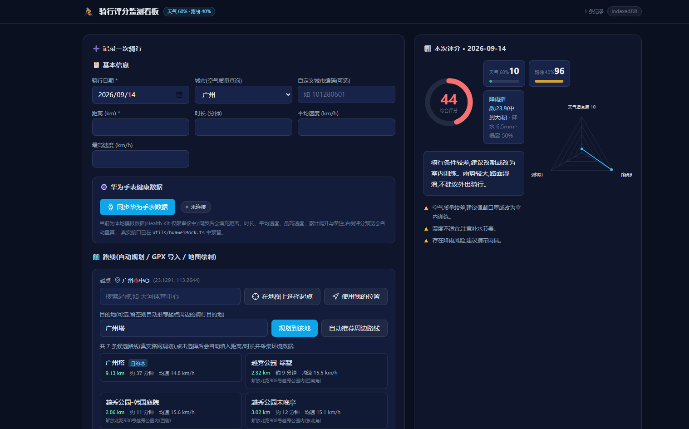
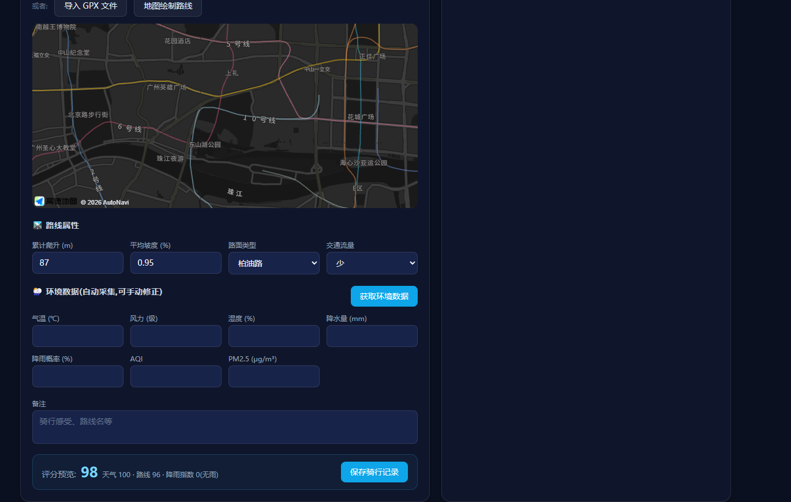
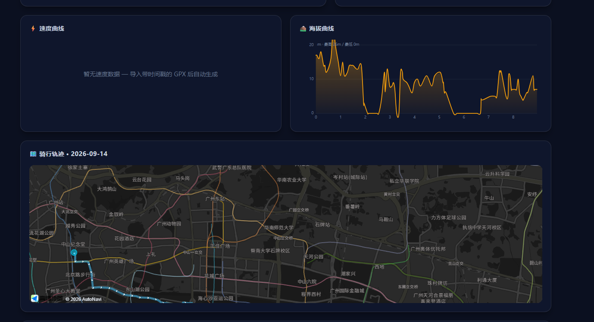
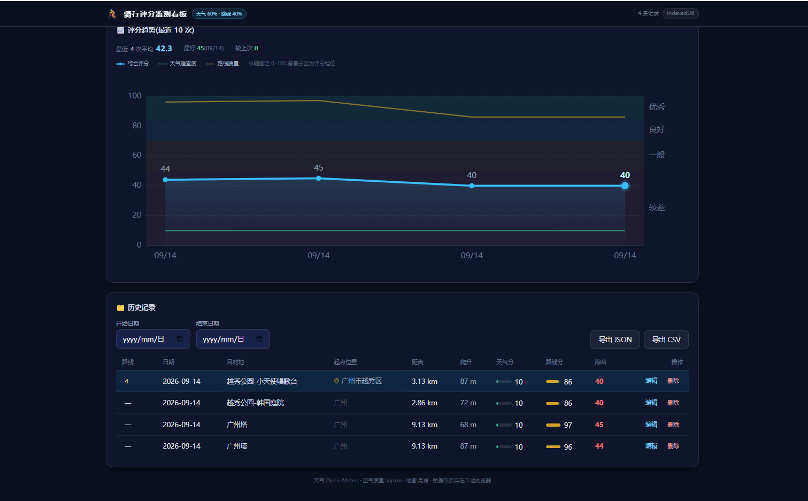

# 🚴 骑行评分监测看板

个人骑行记录与评分可视化看板。记录(手动录入 / GPX 导入 / 地图绘制 / 手表同步)骑行数据后,自动采集当日**天气与空气质量**,结合**路线海拔与坡度**计算本次骑行的综合评分,并以手写 SVG 图表 + 高德地图轨迹的形式展示。数据全部保存在本地浏览器(IndexedDB),无需服务器。

## 界面截图

### 整体界面:数据录入 + 本次评分 + 路线规划

左侧是录入表单(基本信息、华为手表同步、路线自动规划),右侧是综合评分卡与评分雷达图;路线规划会列出真实路网规划出的多条候选路线。



### 路线属性与环境数据

路线属性(累计爬升、平均坡度、路面类型、交通流量)与环境数据(气温、风力、湿度、降水量、降雨概率、AQI、PM2.5)均可自动采集并手动修正,底部实时显示评分预览。



### 骑行轨迹地图

高德地图渲染骑行轨迹,自动标注起点(绿)与终点(红)并适配视野;上方为速度曲线(导入带时间戳的 GPX 后自动生成)。



### 评分趋势与历史记录

趋势图以综合评分为主线、天气/路线分项为对照,叠加评分档位分区;历史记录支持路线编号重命名、起点位置显示到区、时间范围筛选与 JSON/CSV 导出。



## 功能列表

- **骑行数据录入**:手动输入(日期/时长/距离/均速/最高速)、GPX 文件导入(解析轨迹点、时间戳、海拔,自动填充距离/时长/均速/最高速/爬升)、高德地图手动绘制路线(自动测距 + 海拔采样估算爬升)
- **路线自动规划**(推荐用法):不用手绘,直接选择真实路网路线
  - **起点可选**:默认取表单所选城市的市中心,也可「使用我的位置」定位、关键词搜索地点、或**在地图上点选**——设定后地图会立即居中到该点并显示琥珀色图钉,方便确认选在哪里;点选模式下地图光标变为十字
  - **自动推荐周边路线**:以起点为中心自动搜索周边公园/绿道等适合骑行的目的地,逐条规划**真实骑行路线**并列出候选(距离/预计耗时/预计均速/地址),候选按距离梯度分布
  - **指定目的地**:输入地点关键词(高德输入提示),规划去往该地的路线,该路线自动排在首位并选中
  - 选中候选后**自动完成**:填入距离/时长/均速 → 采样海拔算出累计爬升与平均坡度 → 用路线起点自动采集天气与空气质量,一步即可保存
  - 起点在任意城市都可以:先用逆地理编码反查起点所在城市,再用该城市搜索目的地
- **华为手表数据同步**(本地模拟阶段):一键同步手表骑行记录,自动填入距离/时长/平均速度/最高速度/累计爬升与备注,评分预览即时重算
  - 带连接状态指示器(未连接 / 已连接 + 最近同步时间)与同步结果摘要
  - 同步中含 Loading 态(按钮禁用),成功/失败均有 Toast 提示(模拟 10% 失败以验证容错)
  - Health Kit 权限审核中,当前返回本地模拟数据,**不发起任何真实网络请求**;真实接口已在 `src/utils/huaweiMock.ts` 预留(`// TODO: 接入真实后端接口 /api/huawei/cycling-records`),替换函数体即可,调用方无需改动
- **环境数据采集**:Open-Meteo 获取气温/风速/湿度/降水量/降雨概率;空气质量控制 Open-Meteo Air Quality(sojson 备选);所有字段支持手动修正并标注来源
  - 近 92 天走预报接口、更早自动切历史归档接口(归档接口不含降雨概率,此时只用降水量估算并在界面说明)
  - GPX 带时间戳时,按骑行时段提取逐小时降雨(用接口返回的时区偏移对齐 UTC 时间戳,避免时区错位)
- **评分计算**:综合评分 = 天气适宜度 × 60% + 路线质量 × 40%,含降雨指数(rainFactor = 降水量×0.6 + 降雨概率×0.4)、文字评价与改进建议
- **可视化看板**:速度曲线(SVG 折线 + 均速参考线)、海拔曲线(SVG 面积)、评分雷达图(SVG)、地图轨迹(高德)
  - **评分趋势**:最近 10 次骑行,以综合评分折线为主线(渐变面积 + 数值标签 + 末点强调),天气/路线分项用细线作对照;纵轴固定 0–100 并叠加评分档位色带(优秀/良好/一般/较差),上方给出「平均 / 最好 / 较上次」概览数字,图例置于图表外避免遮挡曲线
- **历史记录**:IndexedDB 持久化(不可用时自动降级 localStorage),支持查看/编辑/删除/时间范围筛选,导出 JSON / CSV(CSV 带 BOM,Excel 打开不乱码)
  - **路线编号**:新建记录自动分配序号(1、2、3…),在历史列表里点编号即可重命名(回车确认、Esc 取消,重命名后不影响后续编号递增)
  - **目的地**:规划路线的目的地(或 GPX 轨迹名)独立成列,与路线编号区分
  - **起点位置**:规划路线时取用户选定的起点名(如「珠江新城(地铁站)」「我的位置」);导入 GPX 或手绘路线时由轨迹首个点逆地理编码得到地址;列表里按「市+区」显示(如「广州市天河区」),悬停可看完整地址与坐标。表单里两个字段都可在自动填入后手动修正,CSV 同样导出(含经纬度)
- **健壮性**:全局错误边界(单个组件出错不会白屏,可一键恢复)、地图/天气/存储均有多级降级
- **PWA**:已配置 manifest.json,可安装到桌面;Service Worker 按需求暂未启用(本地开发阶段),后续可通过 `npm run preview` 测试

## 本地运行

```bash
npm install        # 安装依赖
npm run dev        # 启动开发服务器,浏览器打开终端提示的地址(默认 http://localhost:5173)
npm run build      # 生产构建(输出 dist/)
npm run preview    # 预览生产构建
```

> Node 版本要求:18+。

## 高德地图 Key 配置

地图功能需要高德开放平台 Key,本项目已配置好 `.env`:

```ini
VITE_AMAP_KEY=你的Key
VITE_AMAP_SECURITY_CODE=你的安全密钥jscode
```

> **重要**:2021 年 12 月后申请的 JS API Key **必须**同时配置「安全密钥」,否则地图会报 `INVALID_USER_SCODE` 并显示空白。安全密钥在高德控制台的 Key 详情页查看(注意:Key 与安全密钥是两串不同的值,不要填反)。两者都配置正确后,地图模块会随其他功能一起正常加载。
>
> 如需更换 Key:访问 https://lbs.amap.com/ 创建应用 → 添加 Key,**服务平台必须选择「Web端(JS API)」**,然后更新 `.env` 并重启 dev 服务器(Vite 会自动重启)。未配置时地图模块显示申请指引,其余功能不受影响。

### 其他免费 API(无需 Key)

| 用途 | 数据源 | 说明 |
|---|---|---|
| 天气 | Open-Meteo | 近 92 天用预报接口,更早自动切历史归档接口;含逐小时降水量/降雨概率 |
| 海拔 | Open-Meteo Elevation | 规划/绘制路线后按采样点查询,估算累计爬升与平均坡度 |
| 空气质量 | Open-Meteo Air Quality | 提供 `us_aqi` 与 `pm2_5`,支持历史日期(2022 年起)与跨域请求 |
| 空气质量(备选) | sojson | 仅在主数据源失败时尝试;**该接口已基本不可用**(限流 + 浏览器跨域拦截),失败时会提示手动填写 |

### 路线规划(高德 JS API 插件)

自动路线规划使用高德 JS API 的 `AMap.PlaceSearch`(目的地搜索)、`AMap.Riding`(骑行路径规划)、`AMap.AutoComplete`(输入提示)、`AMap.Geocoder`(由起点反查所在城市)四个插件,与地图共用同一个 Key,无需额外的 Web 服务 Key。

> **实现说明**:
> - 高德骑行路径规划单次只返回一条路线(不像驾车会返回多条备选),所以「候选路线」是通过「搜索起点周边的公园/绿道目的地 → 对每个目的地分别规划真实路线」生成的,每条都是真实路网结果。
> - 目的地搜索用的是「城市内关键词搜索」而非「周边搜索」:周边搜索严格按距离排序且有条数上限,在密集城区只会返回几百米内的口袋公园(实测 `pageSize=50` 最远也仅 3.4km),城市内搜索才能拿到全市范围内有代表性的公园/绿道。起点所在城市由 `AMap.Geocoder` 反查得到,因此起点可以选在任意城市。
> - 连续规划多条路线时按 220ms 间隔请求并失败重试一次,避免触发高德接口的 QPS 限流。
> - 上述插件会消耗 Key 的搜索/路径规划配额(个人开发者日常使用足够):一次「自动推荐周边路线」约消耗 1 次逆地理编码 + 1 次 POI 搜索 + 最多 6 次路径规划。

> **关于 sojson**:接口 `api.sojson.com` 目前已无法返回数据(服务端直接返回空响应),因此空气质量默认走 Open-Meteo。`us_aqi` 的分档阈值(50 / 100 / 150)与评分规则一致,不影响评分口径。历史空气质量数据从 2022 年起可查,更早的日期需要手动填写。

## 评分模型

综合评分 = **天气适宜度 × 0.6 + 路线质量 × 0.4**,两维度均从 100 分起扣,保底 0 分。

### 天气适宜度(权重 60%)

| 项目 | 扣分规则 |
|---|---|
| 气温 | 15–25℃ 不扣;每偏离 5℃ 扣 10 分(线性) |
| AQI | <50 不扣;50–100 扣 10;100–150 扣 30;>150 扣 50 |
| 风速 | <3 级不扣;3–4 级扣 10;≥5 级扣 30 |
| 湿度 | 40–60% 不扣;超出扣 10 |
| 下雨指数 | rainFactor = 降水量(mm)×0.6 + 降雨概率(%)×0.4;=0 不扣;≤5 扣 10;≤15 扣 25;≤30 扣 45;>30 扣 70;概率>70% 且无雨扣 15 |

### 路线质量(权重 40%)

| 项目 | 扣分规则 |
|---|---|
| 海拔爬升 | 每 100m 扣 5 分 |
| 平均坡度 | <2% 不扣;2–5% 扣 10;>5% 扣 25 |
| 路面类型 | 柏油路 0;水泥路 5;混合路 10;碎石路 15 |
| 交通流量 | 少 0;中 10;多 20 |

评分逻辑全部在 `src/utils/scoring.ts`,每个扣分项独立成函数,便于调整与测试。

## 技术栈

- React 18 + Vite 5 + TypeScript
- Tailwind CSS 3
- 高德地图 JS API 2.0(`@amap/amap-jsapi-loader`)
- 手写 SVG 图表(折线 / 面积 / 雷达 / 柱状,未使用图表库)
- IndexedDB(Promise 封装 + localStorage 降级)
- Open-Meteo / sojson 免费 API

## 项目结构

```
cycling-dashboard/
├── index.html
├── public/               # manifest.json、图标(PWA)
├── src/
│   ├── App.tsx           # 页面组装
│   ├── types.ts          # 数据类型
│   ├── data/cities.ts    # 城市编码与坐标表
│   ├── components/       # RideForm / RoutePlanner(自动路线规划) / MapView
│   │                     # HuaweiSyncButton(手表同步) / Toast
│   │                     # ScoreCard / ScoreRadar / SpeedChart / ElevationChart
│   │                     # HistoryList / TrendChart / ErrorBoundary
│   ├── hooks/            # useAmap(共享地图 SDK) / useRoutePlanning(路线规划)
│   │                     # useHuaweiSync(手表同步状态)
│   │                     # useIndexedDB / useWeather / useElevation
│   └── utils/            # scoring(评分算法) / gpxParser / chartHelpers
│                         # huaweiMock(手表数据 Mock 层,预留真实接口)
├── .env                  # 高德 Key 配置
└── package.json
```
